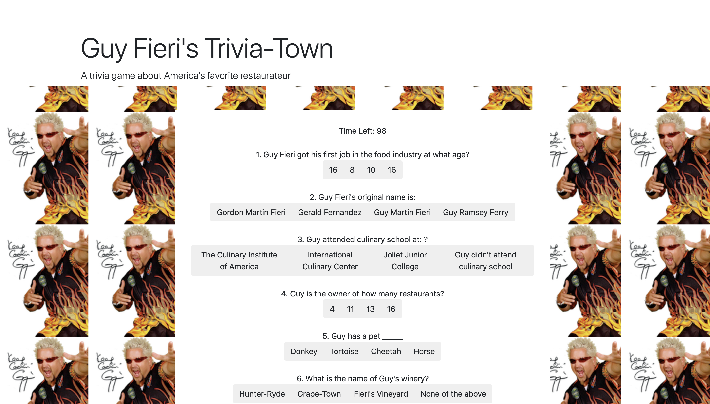

# Guy Fieri's Trivia Town
This is a trivia style game that quizzes the user on facts about American restaurant icon Guy Fieri.

# Instructions
The user has 120 seconds to go through the trivia quiz and select their answers. Upon completion the user will hit "submit" and their score will be calculated. The user then has the options to re-take the quiz.

# Deployment
The game is currently deployed on GitHub pages @ https://bee25141.github.io/TriviaGame2/

# Built With
Bootstrap - The CSS framework used.
jQuery.
JavaScript.
CSS.
HTML.

# Authors
Tony Bee